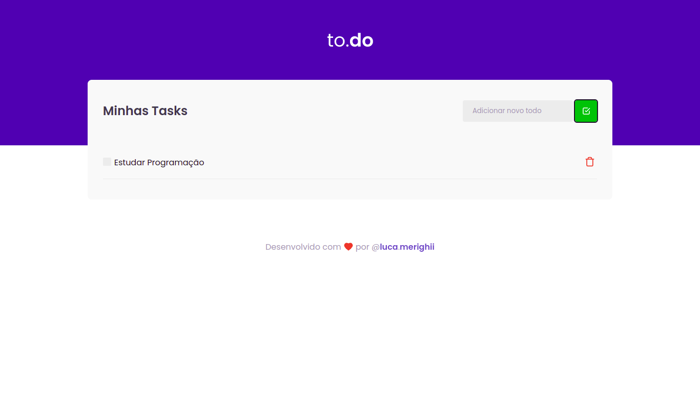

# Ignite ReactJS - todo-list
Desafio da trilha **Ignite ReactJS** na qual refiz a aplicação do zero do meu jeito, colocando em prática conceitos  
básicos do React, como componentização, estado, propriedade, hooks e utilização do TypeScript para adicionar tipagem à aplicação.  
É uma aplicação de uma lista de tarefas do dia-a-dia.  

  

### Aplicação construída com:

